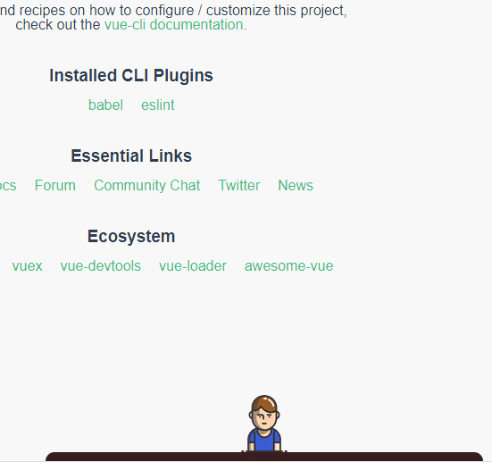

# chatboy

 

The goal of this project is to create a chatbot on a Vue-based web and use the Google Dialogflow API.


## STRUCTURE

```
    
```


## USAGE

> #### Create a Google Cloud project.

- [Google Dialogflow API](https://cloud.google.com/dialogflow/docs/)

- [Google Cloud Platform Project](<https://cloud.google.com/resource-manager/docs/creating-managing-projects>)

  


> #### Get a Dialogflow Authentication key

- [Cloud IAM Service Account](https://cloud.google.com/iam/docs/creating-managing-service-account-keys)

- [Cloud SDK](https://cloud.google.com/sdk/docs/)
- [Dialogflow Setting up authentication](https://dialogflow.com/docs/reference/v2-auth-setup)
- **GOOGLE_APPLICATION_CREDENTIALS**
  
  - [MAC](https://jungwoon.github.io/google%20cloud/2018/01/11/Google-Application-Default-Credential/)
- [WINDOWS 10](https://m.blog.naver.com/PostView.nhn?blogId=chandong83&logNo=220981452650&proxyReferer=https%3A%2F%2Fwww.google.com%2F)
  
- [ACCESS TOKEN](https://github.com/innFactory/react-native-dialogflow/issues/31)

  

> #### Install chatboy

- ```js
  npm install @nnm/chatboy
  ```


> #### Use chatboy

- ```js
  // Your Vuex store
  import store from './store/store.js'
  
  import 'chatboyStore' from '@nnm/chatboy'
  import '@nnm/chatboy/dist/chatboy.css'
  ```
- ```
  ...
  Vue.use(chatboyStore, { store });
  ...
  ```

- ```js
  <Chatboy project-name=""
           language-code=""
           access-token=""
  />
  ```


## PREVIEW




## TODO

- Try Google SDK
- Try SessionStorage
- Try Vuex
- Try KakaoTalk Style CSS


## LEARNED

- Google SDK
  - Get access token
  - Set GOOGLE_APPLICATION_CREDENTIALS
- Vue
  - Image import
- Vuex
  - Use within a npm package
    - Namespacing
    - Modularization
    - Dynamic module registration
    - Plug-in
- Publish npm package
  - Make entry point
  - Set image path
- CSS
  - Make Speech bubble tail
  - Position
  - Flex
- Webpack
  - Default rule of Image bundling on babel


## LICENSE

This is released under the MIT license. See [LICENSE](LICENSE) for details.
